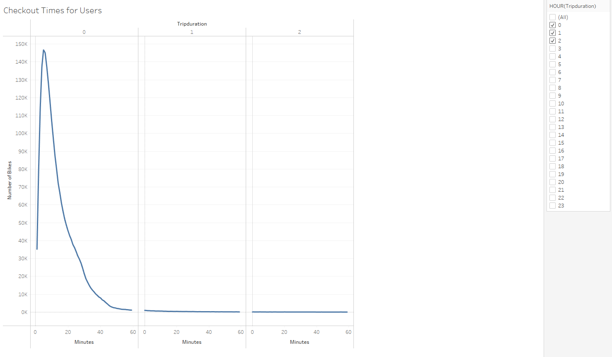
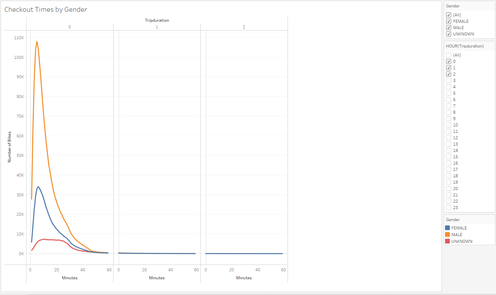
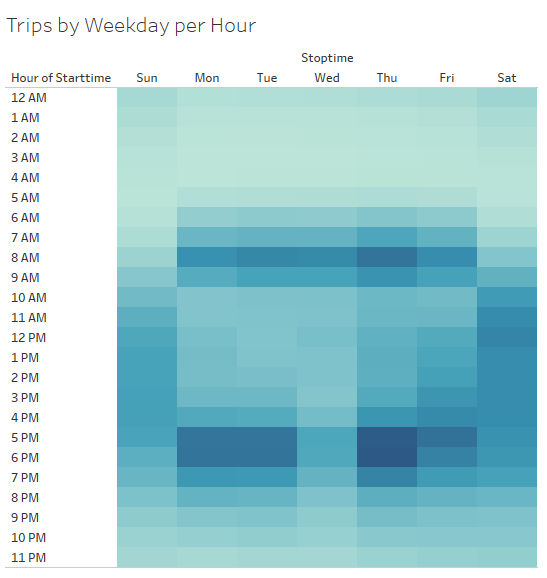
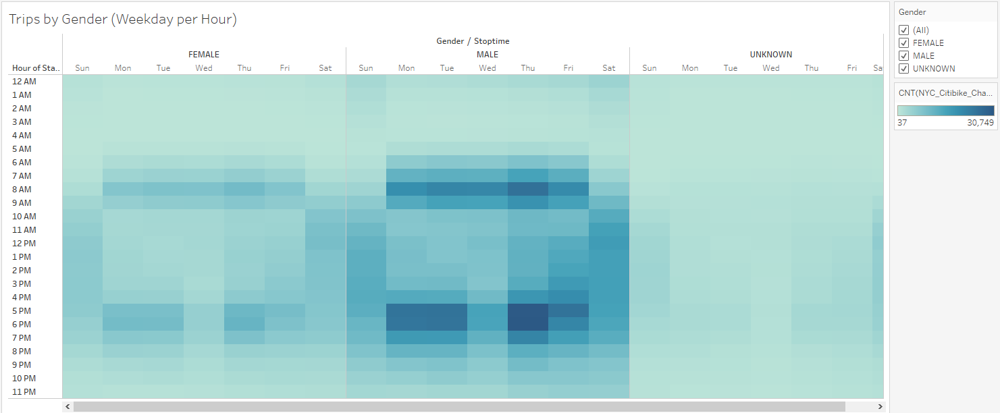
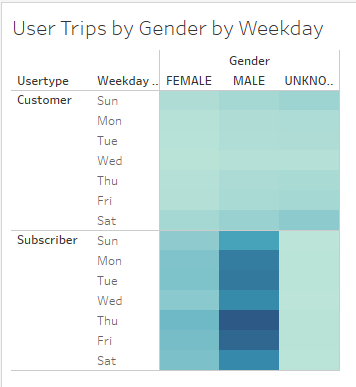
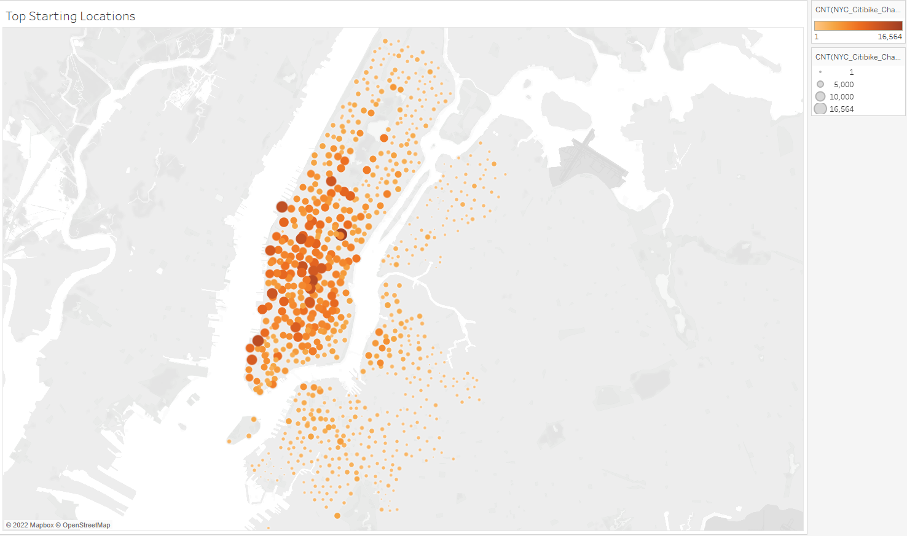
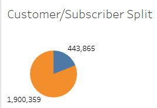

# bikesharing
Data Analysis Bootcamp - Week 14

## Overview
The purpose of this analysis was to look at CitiBike data from NYC and see if we can gather insights to help us bring a similar service to Des Moines, Iowa. We used data downloaded from CitiBike and analyzed it in Tableau.

## Resources
We used August 2019 data, downloaded from [Citi Bike](https://s3.amazonaws.com/tripdata/201908-citibike-tripdata.csv.zip).

## Results

- Link to my tableau public workbook: [NYC_CitiBike_Challenge](https://public.tableau.com/app/profile/ryan.goldsberry/viz/NYC_CitiBike_Challenge_16631946917780/NYCCitiBikeChallengeStory)

- Checkout Times for Users 
 
In this image we see that the vast majority of rides are short trips (less than 30 minutes in length). 

- Checkout Times by Gender 
 
Here the same trends hold, with most rides being less than half an hour in length. What we should take away from this is that people are possibly using the bike after some other form of transit to get to their final destination. If we're going to put bike stations down, they should be near points of interests or business districts, and not spaced too far apart. Most people won't want to bike for 45 minutes to get somewhere and then still have a walk after that.

- Trips by Weekday Per Hour 
 
In this image we see that the most popular times for rides are the commuting hours during the weekdays (8-10am and 5-7pm). If we're going to have bike stations down the ones near business districts should be fully stocked at the before the beginning and end of workdays.

- Trips by Gender (Weekday per Hour) 
 
Here the same trends hold. We can see some bike trips being taken on weekends but will need to do other analysis than splitting by gender to figure out where those rides are going.

- User Trips by Customer Type by Weekday 
 
Here we can see that the commuting days are most popular for our subscribers by far. It seems like people who are able to use the service to get to work become members and use it often. There is an uptick of usage on the weekends for non-subscribers/customers. This tells us that if the bikes are in desirable locations on the weekends, then non-subscribers will hop on.

- Top Starting Locations 
 
The most popular location in NYC is near Grand Central Station. This seems to support the hypothesis from earlier that people may be using the bikes after another form of transit and using them to get to their final location. It also suggests that it will be worthwhile to make sure that we have bike stations near transit hubs.

- Customer/Subscriber Split 
 
Almost one quarter of all the trips taken were taken by non-subscribers. Additional analysis is recommended to figure out the pattern of these non-subscription riders to see if we can convert them to subscribers without too many additional locations or bikes.

## Summary

### High level summary of the results

The two main takeaways I came away with from the above graphs are that people most often use these for short rides, and during commuting hours. The most effective start for us will be to target business districts and transit hubs to get people into the program.

### Two additional visualizations that you would perform with the given dataset.

To start the additional analysis recommended above in the Customer/Subscriber Split graph, I would recreate the "Customer/Subscriber Split" page and split it out by day of the week to see if it's true that weekends are more popular for customers. I would also remake the "Top Starting Locations" graph and filter down to Saturday/Sunday and just customers, looking to see if those top locations coincide with the top locations on weekdays and if it's just a matter of making sure the same areas are stocked with bikes on the weekends, or if we should move the bikes around to more tourist-friendly locations on the weekends.